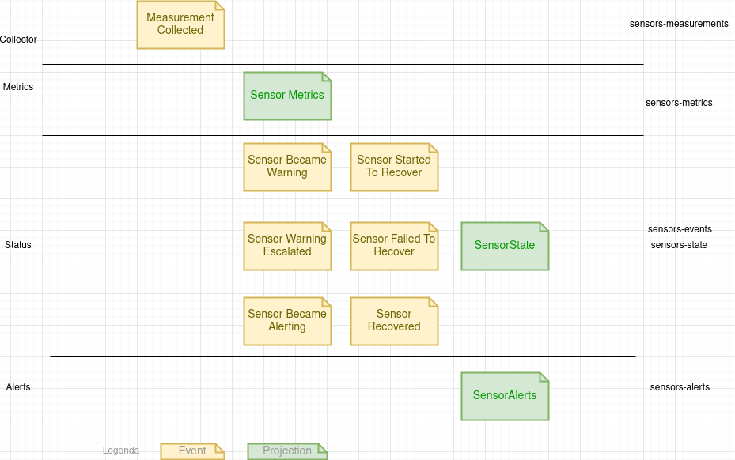
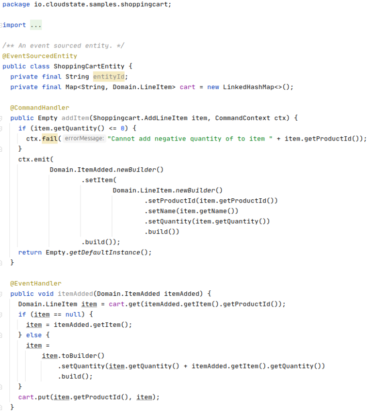
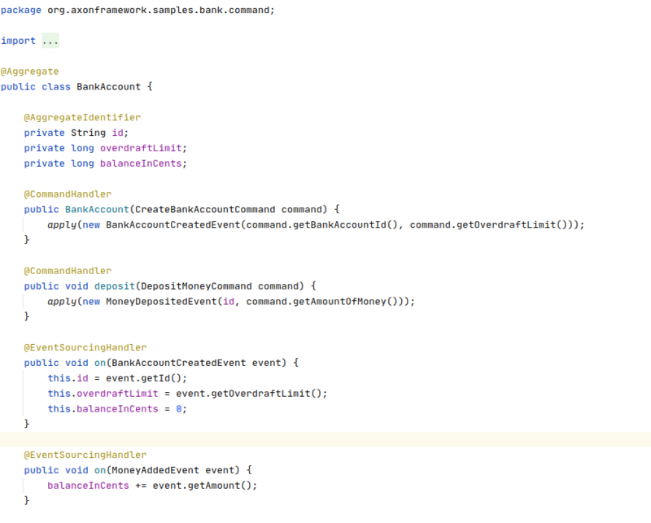
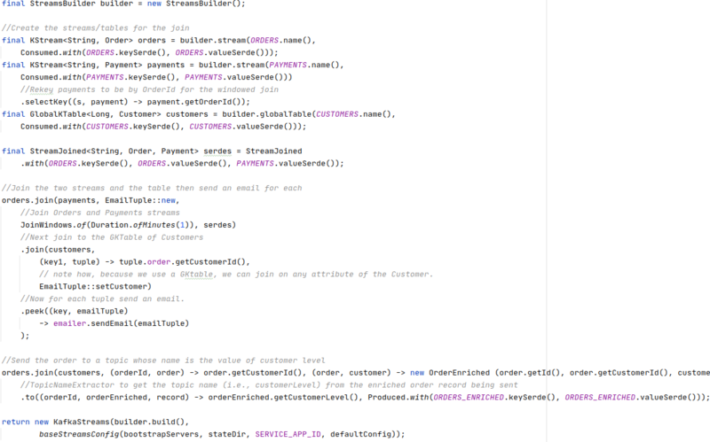

# Architecture overview


---

# But, Before

* What is the problem again?
* How can we understand the problem talking in the same language as product

* Event Storming / eventmodeling.org

* Created by Alberto, an experienced UML consultant
  - Bring together Domain experts and Developers
  - Collaboratively
  - Simply
  - Interactive and Iterative
  - Throw away, try again next week

---

# Represented as events and projections



---

# Immutability as foundation

## Definition
```Scala
(Command aCommand, State currentState): Event
```

```Scala
(Event anEvent, State currentState): State
```

## Implementation

* Just a fold operation.

* Continuously running, without need snapshot

* Encapsulated in an UnitOfWork

---

# Demo
 
 
---

[](https://asciinema.org/a/8ZL0EHLs0Fyezf7ljPcXjoG8R
)

---

[](https://asciinema.org/a/wNAdkZuYKo6gBnndZuTMnvKtj
)


---
# Why?




---
# Why 2



---
# Why 3



---
# Technologies

* Java 14
  - Records, 
  - Switch expressions
  - If instanceOf pattern matching
  
* Spring

* Kafka & Kafka streams

---

# Before production-ready:

* Static analysis 

* Pipelines

* Metrics / Monitoring / Logging

* Kafka Streams Limitations
  - Cooperative reassignment / stand-by
  - Sharded/Partitioned data
  - Schemas

  

---
# Microservice Architecture

* Don't
* Don't
* Driven by the business / conways law represented by bounded contexts
* Considerations about Cohesion / Deployment
* Sharing immutable behaviour
* Mutable state should be internal, not exposed
* Lets go  back to the event storming ;) ... and for discussion